# Forest-Fire-Severity-Analysis
GIS and remote sensing analysis of forest fire severity in Yahangala and Ella, Sri Lanka, focusing on terrain, vegetation, and micro climatic influences.

### Disclaimer
**This repository contains derived outputs and workflows from my published research in *Volume 4, Centre for Environmental Sustainability, 2025*. 
Raw data from the publication cannot be shared publicly due to publisher copyright restrictions.**

### **Technologies and Data Sources**
- ArcGIS Pro  
- Remote Sensing (Satellite Imagery: Sentinel-2B)  
- Gridded Climate Data (Copernicus Climate Data Store)
- Digital Elevation Model (Alaska Sateellite Facility)
- Fire event data (NASA-FIRMS & Department of Forest, Sri Lanka)
---
### **Satellit imagery collection**

**Yahangala fire (2023/08/04)**
- Pre-fire satellite image = 2023/07/28 
- Post-fire satellite image = 2023/08/15

**Ella fire (2025/02/13)** 
- Pre-fire satellite image = 2025/02/10 
- Post-fire satellite image = 2025/02/15
---
### **Factors Considered**
- Burned area extent  
- dNBR (Differenced Normalized Burn Ratio) for fire severity  
- Rainfall and temperature data  
- Wind patterns and humidity  
- Elevation and terrain (slope, aspect)  
- Vegetation type and health  
---
### **Methodology**
- Processed satellite imagery to map burned areas  
- Calculated **dNBR index** to classify fire severity
<table>
  <tr>
    <td align="center">
      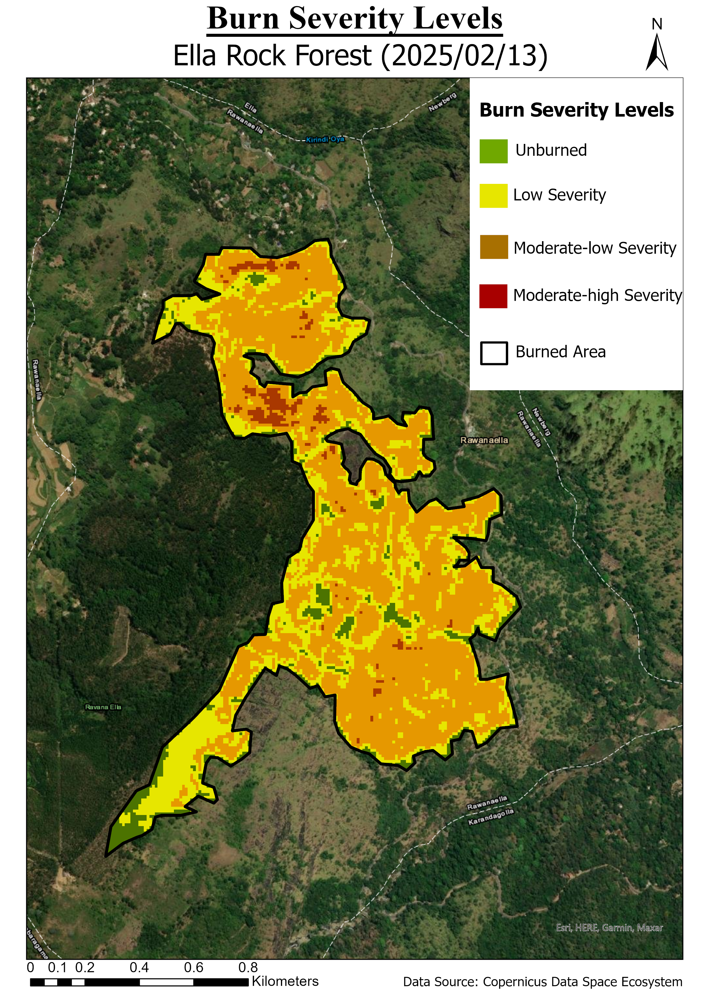 
      <em>Fire Severity Classification Map - Ella</em>
    </td>
    <td align="center">
      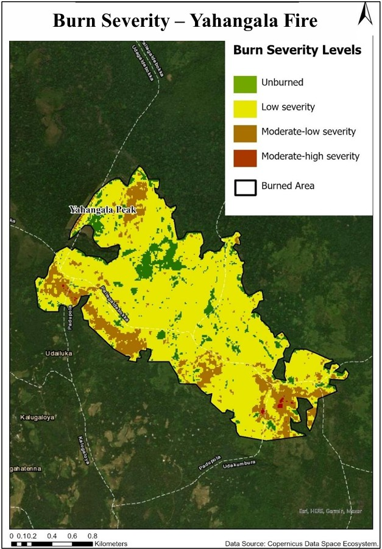 
      <em>Fire Severity Classification Map - Yahangala</em>
    </td>
  </tr>
</table>
- Integrated climatic and environmental datasets  
- Applied spatial analysis to identify influencing factors  
- Compared fire behavior across two regions: Yahangala and Ella

  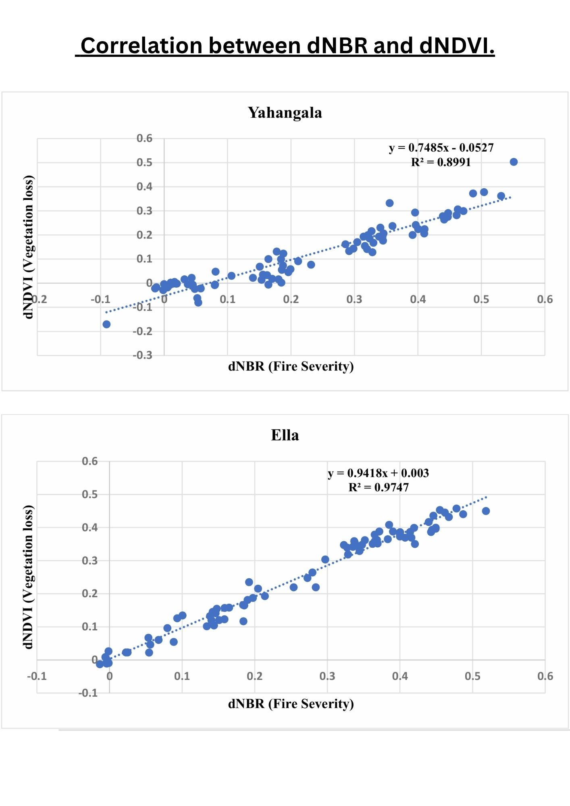
   <em>Comparision – Correlation between dNBR and dNDVI</em>

 

### **Methodology in detail**
The analysis combined **Remote Sensing (RS) and GIS techniques** to assess forest fire severity and its influencing factors.

**1. Burn Severity Analysis**  
- Burn severity was quantified using **NBR** (Normalized Burn Ratio) and **dNBR** (Differenced NBR) from pre- and post-fire Sentinel-2 imagery.  
- dNBR values were classified into **USGS severity levels**: Unburned (< +0.099), Low (+0.100 to +0.269), Moderate-Low (+0.270 to +0.439), Moderate-High (+0.440 to +0.659), and High (+0.660 to +1.300).

<table>
  <tr>
    <td align="center">
      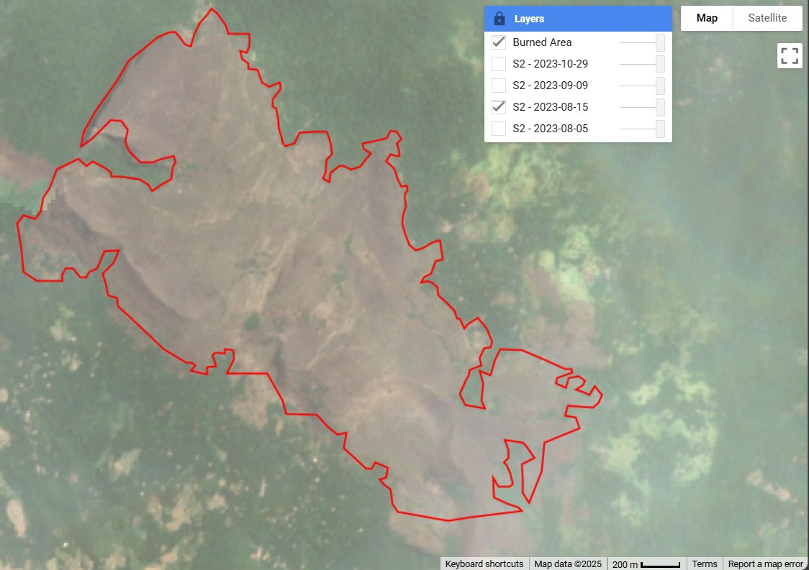 
      <em>Burned Area Map - Yahangala</em>
    </td>
    <td align="center">
      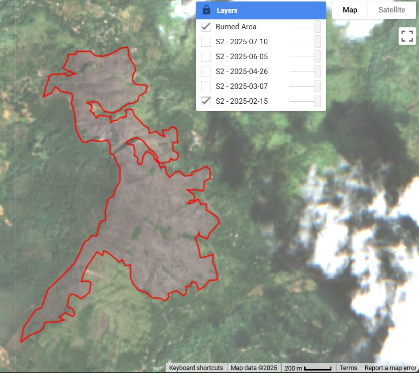 
      <em>Burned Area Map - Ella</em>
    </td>
  </tr>
</table>

**2. Terrain Factors**  
- Derived **slope, aspect, and elevation** from DEMs using ArcGIS Pro.  

  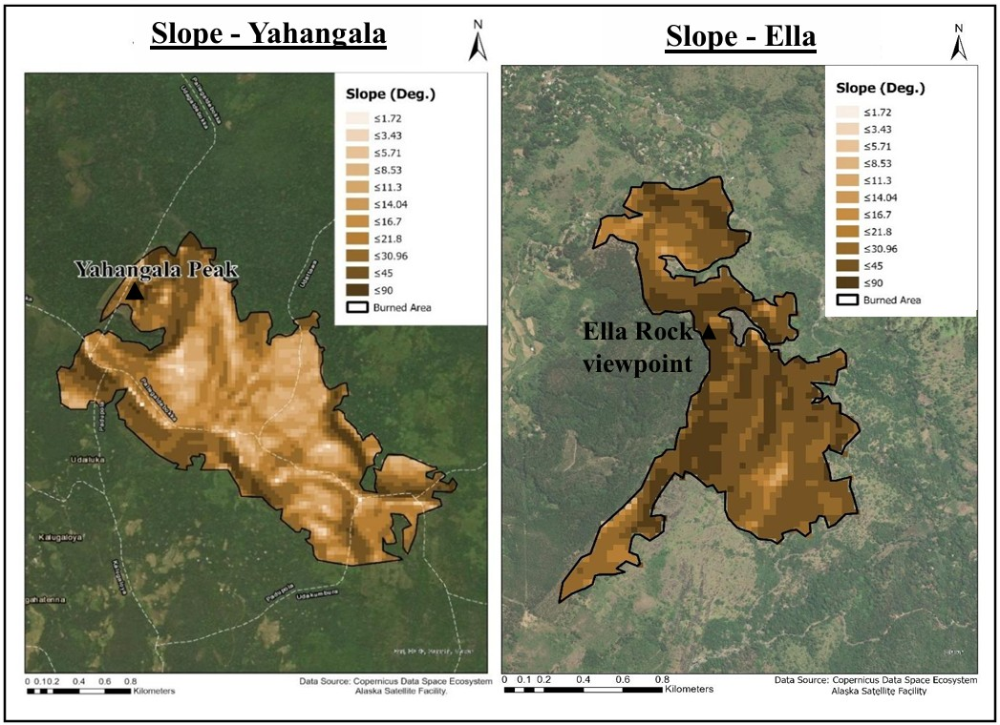
   <em>Comparative Maps - Slope</em>

 

  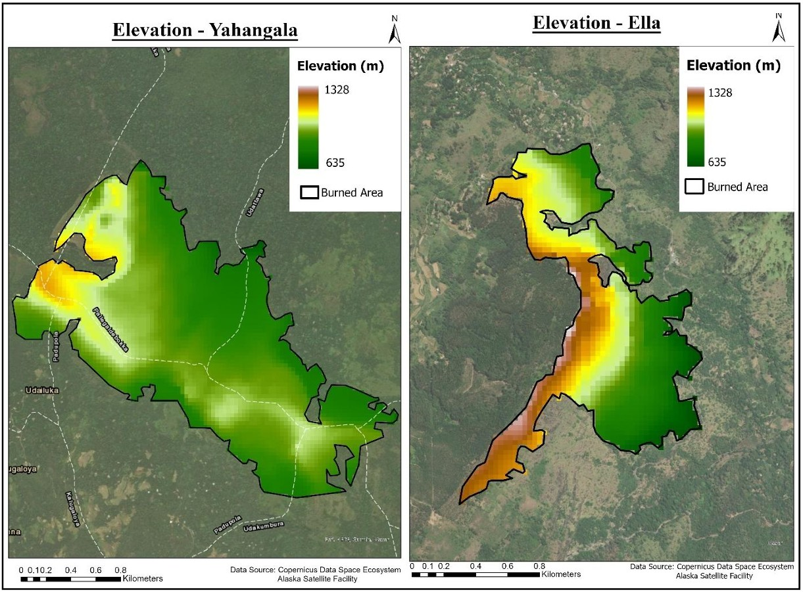
   <em>Comparative Maps - Elevation</em>

 

- Classified terrain features to correlate with burn severity patterns.
<table>
  <tr>
    <td align="center">
       
      <em>Fire Severity Classification Map - Ella</em>
    </td>
    <td align="center">
       
      <em>Fire Severity Classification Map - Yahangala</em>
    </td>
  </tr>
</table>

<table>
  <tr>
    <td align="center">
      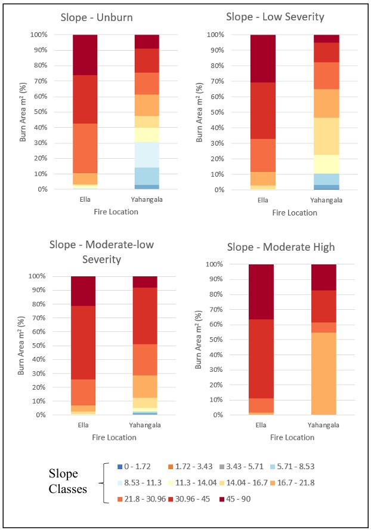 
      <em>Burn Severity by Slope Class</em>
    </td>
    <td align="center">
      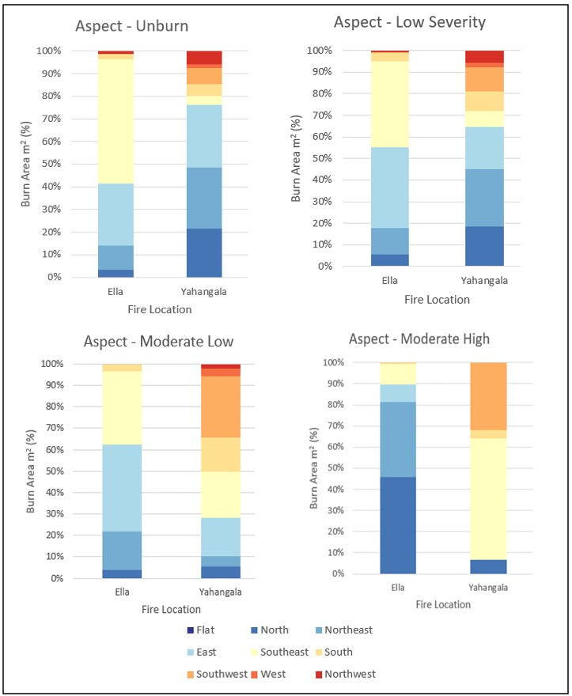 
      <em>Burn Severity by Aspect</em>
    </td>
  </tr>
</table>

**3. Microclimatic Factors**  
- Temperature, rainfall, relative humidity, wind speed, and wind direction were extracted from **ERA5 datasets**.  
- Short-term pre-fire conditions were analyzed to assess their influence on fire behavior.

  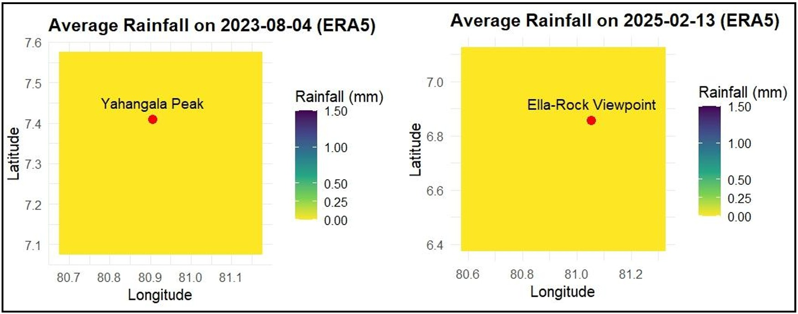
   <em>Comparative Maps – Average Rainfall on the day of fire</em>

 

  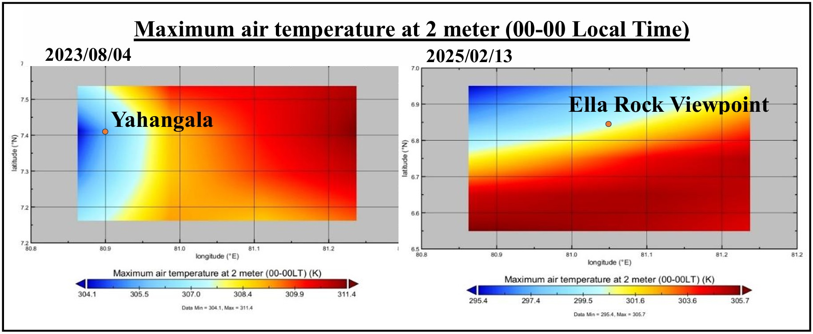
   <em>Comparative Maps – Maximum Air Temperature at 2 meter</em>

    

  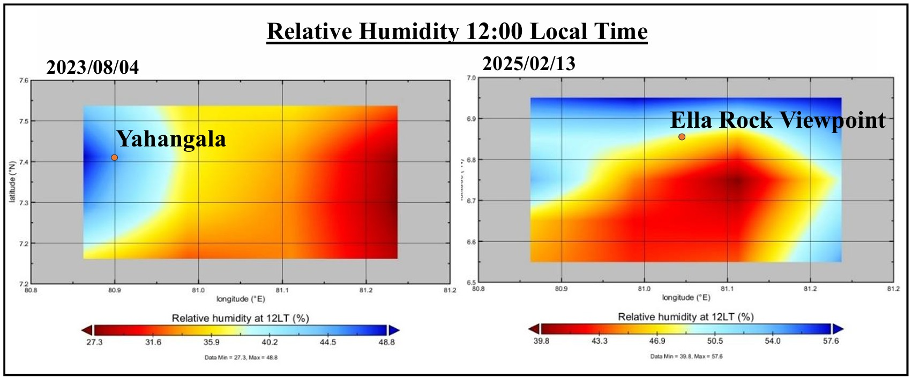
   <em>Comparative Maps – Relative Humidity</em>

  

  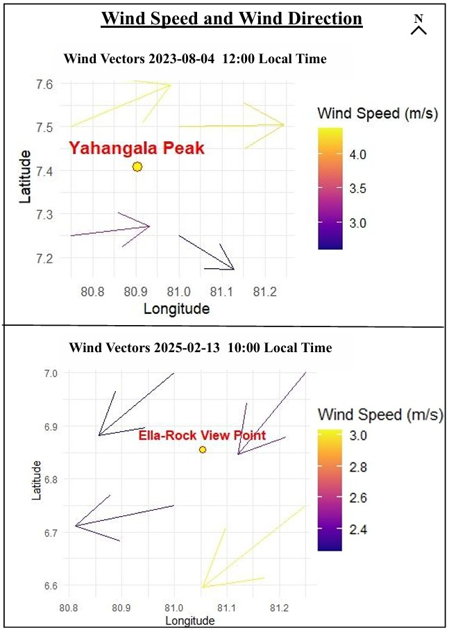
   <em>Comparative Maps - Wind Speed and Wind Direction</em>

  

**4. Vegetation Health and Type**  
- Vegetation types were identified using **supervised classification** on pre-fire Sentinel-2 imagery.

  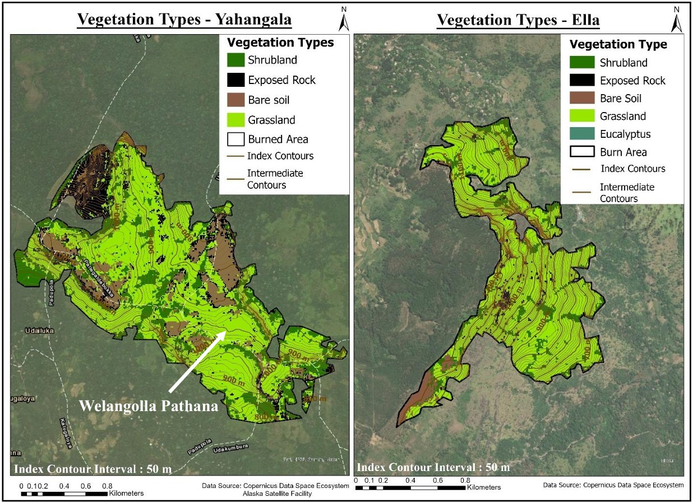
   <em>Comparative Maps – Vegetation Types</em>

  
- **NDVI and dNDVI** were calculated to assess vegetation health and loss after fires.

  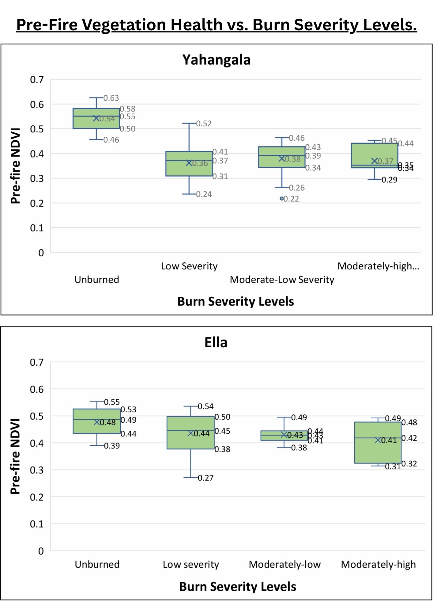
   <em>Comparision – Pre fire vegetation health vs burn severity</em>

  

This workflow provided a **spatially explicit assessment of fire severity**, linking environmental and climatic factors to fire behavior in Yahangala and Ella.
---
### **Key Findings**
- Ella experienced **moderate–low fire severity**, strongly influenced by terrain-driven wind channeling. Slope–aspect alignment with prevailing winds intensified fire spread.  
- Yahangala showed **mostly low severity**, due to fire-resistant vegetation and weaker terrain–wind alignment.  
- Larger burned areas did **not necessarily mean higher severity**; fire behavior was site-specific.  
- Areas with weaker vegetation health were more vulnerable, particularly in Yahangala.  
- Elevations between **900–1100 m** in both regions were more fire-prone, showing the link between altitude, vegetation, and microclimate.  
---
### **Conclusion**
Forest fire severity in Sri Lanka’s montane ecosystems is highly **location-specific** and shaped by the complex interaction of terrain, vegetation, and microclimatic conditions. Generalized fire models cannot accurately represent these dynamics.
---

### **Skills Gained**
- Remote sensing workflows (satellite data processing, dNBR calculation)  
- GIS-based hazard modeling  
- Environmental pattern recognition  
- Site-specific risk assessment for fire management  
---

### **Note**
Due to software access limitations, the original ArcGIS project file (.aprx) is not included. All results are presented through outputs, analysis, and visualizations.
---

