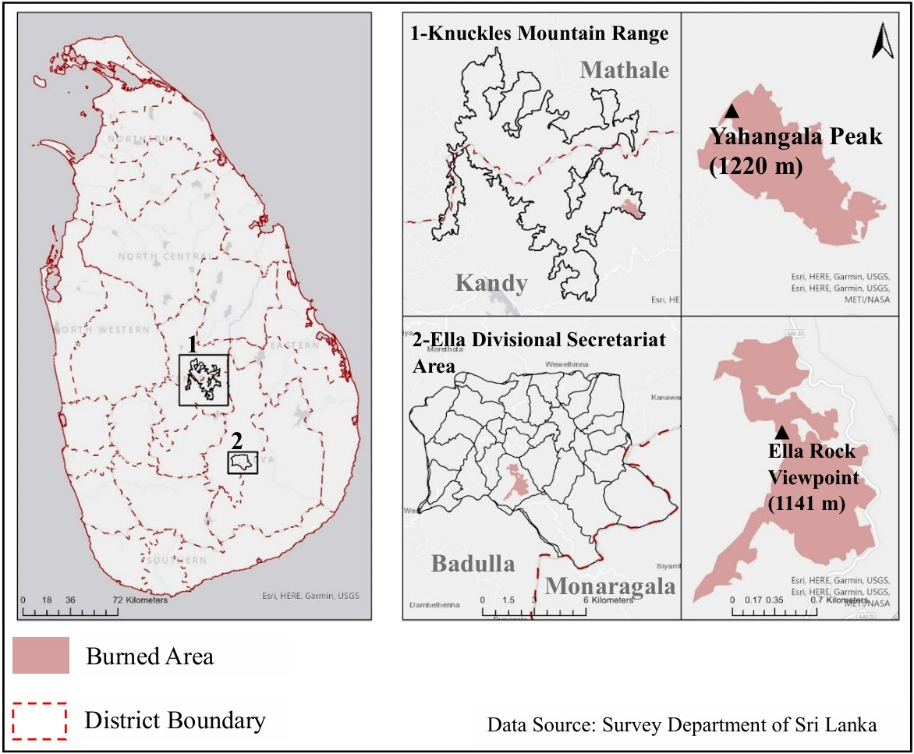

# Forest-Fire-Severity-Analysis
GIS and remote sensing analysis of forest fire severity in Yahangala and Ella, Sri Lanka, focusing on terrain, vegetation, and micro climatic influences.
### Disclaimer

This repository presents derived outputs and independent analysis based on my published research:
*Centre for Environmental Sustainability, Volume 4 (2025).* 

All maps and visualizations included here are generated by the author for portfolio purposes. The full publication and raw datasets are not shared due to publisher copyright restrictions.

---
## Introduction

Forest ecosystems play a vital role in regulating climate, supporting biodiversity, and maintaining hydrological balance. However, forest fires are an increasing global concern due to climate variability, land-use changes, and human activities. Although Sri Lanka is not traditionally wildfire-prone, recent years have seen a rise in fire incidents, particularly in ecologically sensitive regions.

This project analyzes forest fire severity in Sri Lanka using Geographic Information Systems (GIS) and Remote Sensing (RS) techniques, focusing on two major events:

- **Yahangala Fire (August 4, 2023)** – Knuckles Mountain Range  
- **Ella Fire (February 13, 2025)** – Badulla District  

Burn severity is assessed using spectral indices such as **dNBR** and **dNDVI**, enabling spatial mapping of fire-affected areas.

In addition, the study examines the influence of key environmental factors:

- Terrain (slope, aspect, elevation)  
- Microclimate (temperature, rainfall, humidity, wind)  
- Vegetation condition  

By integrating these variables, the project provides a comprehensive spatial analysis of fire severity and its driving factors, addressing a key gap in Sri Lankan wildfire research.

---

## Why this project matters

- Supports forest management and fire mitigation planning  
- Identifies high-risk and vulnerable areas  
- Contributes to climate-resilient land management  
- Provides insights into ecosystem recovery  

---

## Summary

This repository presents a comparative geospatial analysis of wildfire dynamics in Sri Lanka, offering valuable insights for researchers, policymakers, and environmental managers.
--- 
### **Key Findings**
- Ella experienced **moderate–low fire severity**, strongly influenced by terrain-driven wind channeling. Slope–aspect alignment with prevailing winds intensified fire spread.  
- Yahangala showed **mostly low severity**, due to fire-resistant vegetation and weaker terrain–wind alignment.  
- Larger burned areas did **not necessarily mean higher severity**; fire behavior was site-specific.  
- Areas with weaker vegetation health were more vulnerable, particularly in Yahangala.  
- Elevations between **900–1100 m** in both regions were more fire-prone, showing the link between altitude, vegetation, and microclimate.  
---

### **Technologies and Data Sources**
- ArcGIS Pro  
- Remote Sensing (Satellite Imagery: Sentinel-2B)  
- Gridded Climate Data (Copernicus Climate Data Store)
- Digital Elevation Model (Alaska Satellite Facility)
- Fire event data (NASA-FIRMS & Department of Forest, Sri Lanka)
---
### **Satellite imagery collection**

**Yahangala fire (2023/08/04)**
- Pre-fire satellite image = 2023/07/28 
- Post-fire satellite image = 2023/08/15

**Ella fire (2025/02/13)** 
- Pre-fire satellite image = 2025/02/10 
- Post-fire satellite image = 2025/02/15
---
### **Factors Considered**
- Burned area extent  
- dNBR (Differenced Normalized Burn Ratio) for fire severity  
- Rainfall and temperature data  
- Wind patterns and humidity  
- Elevation and terrain (slope, aspect)  
- Vegetation type and health  
---
### Study Area

  
   <em>Study Area Map</em>

 
This study focuses on two tropical montane forest regions in Sri Lanka: Yahangala (Knuckles Mountain Range) and Ella Rock Forest (Badulla District).

Yahangala (1220 m) is located on the eastern boundary of the Knuckles massif in the Kandy District. The area is characterized by grass-dominated landscapes, exposed rocky surfaces, and high lightning activity. As part of the UNESCO-listed Knuckles Conservation Forest, it supports rich biodiversity with endemic species. The region experiences a tropical montane climate, receiving 1900–2500 mm annual rainfall, mainly from the northeast monsoon, with a pronounced dry period that increases fire susceptibility.

Ella Rock Forest (1041 m), located in the Badulla District, consists of montane forest patches, grasslands, and eucalyptus plantations. It is influenced primarily by the southwest monsoon, receiving 2000–2500 mm annual rainfall, with moderate temperature variation due to elevation. The area is ecologically significant and widely known for tourism and hiking.

Although both locations belong to the tropical montane ecosystem of Sri Lanka, they differ in terrain configuration, vegetation composition, and microclimatic conditions. These contrasts make them ideal for a comparative analysis of fire severity and its controlling factors.

### **Methodology**
- Processed satellite imagery to map burned areas  
- Calculated **dNBR index** to classify fire severity
<table>
  <tr>
    <td align="center">
       
      <em>Fire Severity Classification Map - Ella</em>
    </td>
    <td align="center">
       
      <em>Fire Severity Classification Map - Yahangala</em>
    </td>
  </tr>
</table>
- Integrated climatic and environmental datasets  
- Applied spatial analysis to identify influencing factors  
- Compared fire behavior across two regions: Yahangala and Ella

  
   <em>Comparison – Correlation between dNBR and dNDVI</em>

 

### **Methodology in detail**
The analysis combined **Remote Sensing (RS) and GIS techniques** to assess forest fire severity and its influencing factors.

**1. Burn Severity Analysis**  
- Burn severity was quantified using **NBR** (Normalized Burn Ratio) and **dNBR** (Differenced NBR) from pre- and post-fire Sentinel-2 imagery.  
- dNBR values were classified into **USGS severity levels**: Unburned (< +0.099), Low (+0.100 to +0.269), Moderate-Low (+0.270 to +0.439), Moderate-High (+0.440 to +0.659), and High (+0.660 to +1.300).

<table>
  <tr>
    <td align="center">
       
      <em>Burned Area Map - Yahangala</em>
    </td>
    <td align="center">
       
      <em>Burned Area Map - Ella</em>
    </td>
  </tr>
</table>

**2. Terrain Factors**  
- Derived **slope, aspect, and elevation** from DEMs using ArcGIS Pro.  

  
   <em>Comparative Maps - Slope</em>

 

  
   <em>Comparative Maps - Elevation</em>

 

- Classified terrain features to correlate with burn severity patterns.
<table>
  <tr>
    <td align="center">
       
      <em>Fire Severity Classification Map - Ella</em>
    </td>
    <td align="center">
       
      <em>Fire Severity Classification Map - Yahangala</em>
    </td>
  </tr>
</table>

<table>
  <tr>
    <td align="center">
       
      <em>Burn Severity by Slope Class</em>
    </td>
    <td align="center">
       
      <em>Burn Severity by Aspect</em>
    </td>
  </tr>
</table>

**3. Microclimatic Factors**  
- Temperature, rainfall, relative humidity, wind speed, and wind direction were extracted from **ERA5 datasets**.  
- Short-term pre-fire conditions were analyzed to assess their influence on fire behavior.

  
   <em>Comparative Maps – Average Rainfall on the day of fire</em>

 

  
   <em>Comparative Maps – Maximum Air Temperature at 2 meter</em>

    

  
   <em>Comparative Maps – Relative Humidity</em>

  

  
   <em>Comparative Maps - Wind Speed and Wind Direction</em>

  

**4. Vegetation Health and Type**  
- Vegetation types were identified using **supervised classification** on pre-fire Sentinel-2 imagery.

  
   <em>Comparative Maps – Vegetation Types</em>

  
- NDVI and dNDVI were calculated to assess vegetation health and loss after fires.

  
   <em>Comparison – Pre fire vegetation health vs burn severity</em>

  

This workflow provided a **spatially explicit assessment of fire severity**, linking environmental and climatic factors to fire behavior in Yahangala and Ella.

---

### **Conclusion**
Forest fire severity in Sri Lanka’s montane ecosystems is highly **location-specific** and shaped by the complex interaction of terrain, vegetation, and microclimatic conditions. Generalized fire models cannot accurately represent these dynamics.

---

### **Skills Gained**
- Remote sensing workflows (satellite data processing, dNBR calculation)  
- GIS-based hazard modeling  
- Environmental pattern recognition  
- Site-specific risk assessment for fire management  
---

### **Note**
Due to software access limitations, the original ArcGIS project file (.aprx) is not included. All results are presented through outputs, analysis, and visualizations.

Author : Theekshana Pathirana
BSc. in Geographical Information Science

---

